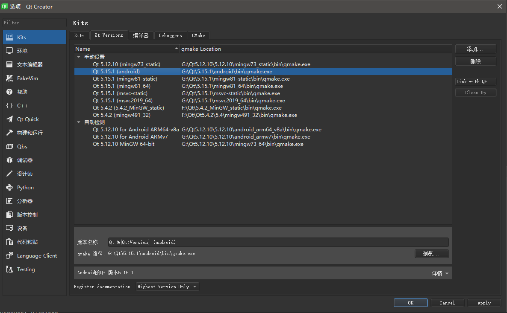

## Build notes

*If building  fastly, just remove module\*.so from ./dest and rebuild Application*

build Libraries.pro first and Application then.

## Build Logs

**11/16/2020** - v2.5 ([Code](https://github.com/ultrapre/stellarium/commit/35b739e1dac74a666e53a1c41b51ae93cc04b055))

suit for v0.20.3+

you need to hand make some unsuccessful plugins.

**11/16/2020** - v2.2 ( [Code](https://github.com/DreamNik/stellarium/commit/eeacd9ef0bcd58c0a319527fb2f01519d11b4ed2) , Kits same as v2.0)

it's 0.20.3+, run success, zooming success. All plugins exclude TelescopeControl.

**11/16/2020** - v2.1 ( [Code](https://github.com/DreamNik/stellarium/commit/eeacd9ef0bcd58c0a319527fb2f01519d11b4ed2) , Kits same as v2.0)

it's 0.20.3+, run success, zooming success. No plugins.

**11/15/2020** - v2.0 (PC 0.20.3, Qt5.15.1+NDK21)

[source code](https://github.com/ultrapre/stellarium/commit/26d029629a80a67d731a30c4245fafd6dccf4424)

assets203 copied from stellarium installer pack.

0.20.3 run success on Mobile, but plugin not be well compile, and zooming not works. It seems only debug mode's apk can work?

note: select kits strictly (clang android for C/C++, arm, NDK21)

debug for bugs, enjoy fun!

version and kits:

**11/11/2020**

using Qt5.15.2, building ——

1.mobile ver on stellarium-android_fixes: run success.

2.mobile ver on 0.18.2: run fail

3.mobile ver on 0.20.3: run fail

4.Windows MSVC static on above 3 version: run success.

https://github.com/ultrapre/Stellarium_Mobile_LTS/tree/main/Projects_New/v1.1

**10/31/2020** - v1.1.1 (PC 0.18.0+, NDK: android-30)

qt 5.14.2, ndk-21

**10/28/2020** - v1.1 (PC 0.18.0+, NDK: android-26)

Windows10x64,

qt-opensource-windows-x86-5.12.5.exe, check MinGW32+ARMv7+QtScript+MinGW32(Tools)

android-ndk-r19c-windows-x86_64.zip

Qt: 

open Libraries.pro: ARMv7 release

Qt --> Projects --> Build Environment --> ANDROID_NDK_PLATFORM = android-26

ban Make install and Build Android APK

change context in _config.pri, source code still stellarium-android_fixes

don't change make to mingw32-make.exe, keep NDK's compiler(make.exe)

build Libraries

open Application.pro: ARMv7 release

Qt --> Projects --> Build Environment --> ANDROID_NDK_PLATFORM = android-26

Build Android APK --> Application --> Android build SDK: android-30

change line 44 45 to android-26

Compile and meet error in gradle function:

`com.android.build.gradle.tasks.factory.AndroidJavaCompile.setDependencyCacheDir(Ljava/io/File;)V`

comment out `DISTFILES +=` and remove android/*

and it will produce new.

finish

**10/27/2020** - initial version (PC 0.18.0+, NDK: android-21)

rebuild sucessfully.

Deepin 1002, qt-opensource-linux-x64-5.9.6.run, ndk 10e, [Source Code](https://github.com/DreamNik/stellarium/tree/1fc06cdbcbb172310fd86fd185c4ae0d9a187523), [Project Build Files](https://drive.google.com/open?id=1zP6JEOuF4vbsziwofh6mfUDt5HZKaSbh)

No need to unpack source code and project build files to thge same directory.

Install Qt Android-arm v7 + QtScripts

Open _config.pri, edit:

STEL = source code directory

STEL_ASSETS = assets, you can extract from existing projects

DESTDIR     = build-Libraries-Android_for_armeabi_v7a_GCC_4_9_Qt_5_9_6_for_Android_armv7_e3cfb7-Debug/android-build/libs/armeabi-v7a

Qt --> Projects --> Build Environment --> ANDROID_NDK_PLATFORM = android-21

First build "Libraries.pro" to produce *.so, then build "Application.pro" to produce apk.

Test pass.
